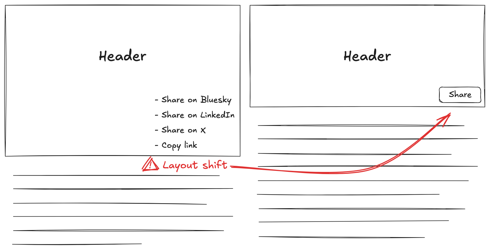

## What is FOUC and how does it apply to web components?

A [flash of unstyled content][fouc] (FOUC) occurs when content on a web page is visible
before it has had styling applied to it. This can happen for a few reasons, often while
loading images that are used in the site layout, using web fonts that either don't appear
until loaded or show differently or more commonly with JavaScript that applies styling to
content already visible in the page. Web components are susceptible to all of this and
introduce even more opportunity to FOUC things up, especially with the use of Shadow DOM
and slots.

I recently built the share button for my website&mdash;up in header, feel free to use
it&mdash;that presented me with an opportunity to think about and deal with a flash of
unstyled content _and_ a [cumulative layout shift][cls].

Here's how I prevented both.

## The share button web component

The share button is a small web component that attempts to use the [native share
functionality][navigator-share] in the browser. At the time of writing this feature has
good support across browsers but I wanted to also provide a fallback list of links as the
initial content of the component. Once the share button element is upgraded the list of
links is replaced with a single share button.

```html
<share-button>
  <ul>
    <li>
      <a href="https://bsky.app/intent/compose?text={title}%20{url}">🦋 Share on Bluesky</a>
    </li>
    <li>
      <a href="https://www.linkedin.com/shareArticle?url={url}&title={title}">🏢 Share on LinkedIn</a>
    </li>
    <li>
      <a href="https://x.com/intent/post?url={url}&text={title}&via={author}">💩 Share on X</a>
    </li>
  </ul>
</share-button>
```

Even after applying some styles to the list you can probably see that the share button will
take up less vertical space. When the button replaces the links the page beneath the header
will shift upwards and causes a cumulative layout shift.

<figure>
  
  <figcaption>
    Cumulative layout shift between the fallback links and share button
  </figcaption>
</figure>

### How to fix cumulative layout shift

To avoid the layout shift entirely the list of fallback links needs to occupy the same amount
of vertical space as the share button. I could have tried to display the list items inline
but that wouldn't go any way to resolving a flash of unstyled content, the links swapping to
the button. To solve both issues I made the fallback work in a similar way to the share
button by using a popover to display the links with a button as the trigger.

```html
<share-button>
  <button popovertarget="share-fallback">Share</button>

  <div id="share-fallback" popover>
    <h2>Share this page</h2>

    <ul>
      <li>
        <a href="https://bsky.app/intent/compose?text={title}%20{url}">🦋 Share on Bluesky</a>
      </li>
      <li>
        <a href="https://www.linkedin.com/shareArticle?url={url}&title={title}">🏢 Share on LinkedIn</a>
      </li>
      <li>
        <a href="https://x.com/intent/post?url={url}&text={title}&via={author}">💩 Share on X</a>
      </li>
    </ul>
  </div>
</share-button>
```

Now if for some reason the native share functionality isn't supported or the web component isn't yet
connected the popover with the fallback list of links is displayed when the button is clicked. Only
issue now is the button in the web component is duplicated in the fallback content, let's fix it.

### Using a named slot to share the button

I could have shared the CSS to style both buttons but it seemed better yet to share the button
itself. Sharing the button is achieved by adding a Shadow Root to the component with a single
named slot in which to place the button.

```js
class ShareButton extends HTMLElement {
  connectedCallback() {
    const slot = document.createElement('slot')
    slot.setAttribute('name', 'share-btn')

    const shadowRoot = this.attachShadow({ mode: 'open' })
    shadowRoot.appendChild(slot)

    // Simplified for brevity
    slot.addEventListener('click', (ev) => {
      ev.preventDefault()

      navigator.share({
        title: document.title,
        url: location.href
      })
    })
  }
}
```

Add the slot attribute to the button.

```html
<share-button>
  <button slot="share-btn" popovertarget="share-fallback">Share</button>

  <div id="share-fallback" popover>
    <h2>Share this page</h2>

    <ul>
      <li>
        <a href="https://bsky.app/intent/compose?text={title}%20{url}">🦋 Share on Bluesky</a>
      </li>
      <li>
        <a href="https://www.linkedin.com/shareArticle?url={url}&title={title}">🏢 Share on LinkedIn</a>
      </li>
      <li>
        <a href="https://x.com/intent/post?url={url}&text={title}&via={author}">💩 Share on X</a>
      </li>
    </ul>
  </div>
</share-button>
```

Now when the `share-button` element is upgraded the popover will no longer be displayed
and only the native share functionality will be observed when the button is clicked.

I've packaged the share button into a [shared component][package] you can easily use
in your own website.

## Handling FOUC without a fallback

The approach used to build the share button is one of [progressive enhancement][progressive-enhancement].
If the component does not have appropriate fallback or initial content then other options
can be used to prevent the flash of unstyled content.

### Hiding elements until they are defined

A quick search, or prompt to your _trusted_ AI, on this subject will likely lead you to the
`:defined` CSS selector.

```css
/* Hide the element until it's defined */
my-element:not(:defined) {
  display: none;
}

/* Show and style the element in it's defined state */
my-element:defined {
  display: block;
}
```

It's a valid approach but the potential for a cumulative layout shift is still present.
You could toggle the `visibility` or `opacity` of the component instead but if the
dimensions change when it becomes defined it will probably still cause a significant
layout shift.

### Declarative Shadow DOM

With [Declarative Shadow DOM][declarative-shadow-dom] you can render the component from a
template that is attached to the elements shadow root when the component HTML is parsed.
Taking the share button example, the fallback content and button styling could be encapsulated
in the component. The component can then replace the button functionality with the native share
API call or do nothing and maintain the fallback.

```html
<share-button>
  <template shadowrootmode="open">
    <style>
      /* Fallback and button styles */
    </style>

    <button popovertarget="share-fallback">Share</button>

    <div id="share-fallback" popover>
      <h2>Share this page</h2>

      <ul>
        <li>
          <a href="https://bsky.app/intent/compose?text={title}%20{url}">🦋 Share on Bluesky</a>
        </li>
        <li>
          <a href="https://www.linkedin.com/shareArticle?url={url}&title={title}">🏢 Share on LinkedIn</a>
        </li>
        <li>
          <a href="https://x.com/intent/post?url={url}&text={title}&via={author}">💩 Share on X</a>
        </li>
      </ul>
    </div>
  </template>
</share-button>
```

This approach is probably more useful for content that is important for SEO as it can be
rendered in HTML but only displayed once the component is upgraded. There won't be any
issue with FOUC (unless the browser doesn't support Declarative Shadow DOM) but the
potential for CLS still needs to be considered.

[fouc]: https://en.wikipedia.org/wiki/Flash_of_unstyled_content
[navigator-share]: https://developer.mozilla.org/en-US/docs/Web/API/Navigator/share
[cls]: https://web.dev/articles/cls
[popover]: https://developer.mozilla.org/en-US/docs/Web/HTML/Global_attributes/popover
[progressive-enhancement]: https://www.gov.uk/service-manual/technology/using-progressive-enhancement
[defined]: https://developer.mozilla.org/en-US/docs/Web/CSS/:defined
[declarative-shadow-dom]: https://web.dev/articles/declarative-shadow-dom
[package]: https://github.com/p-m-p/parsonic?tab=readme-ov-file#share-button
