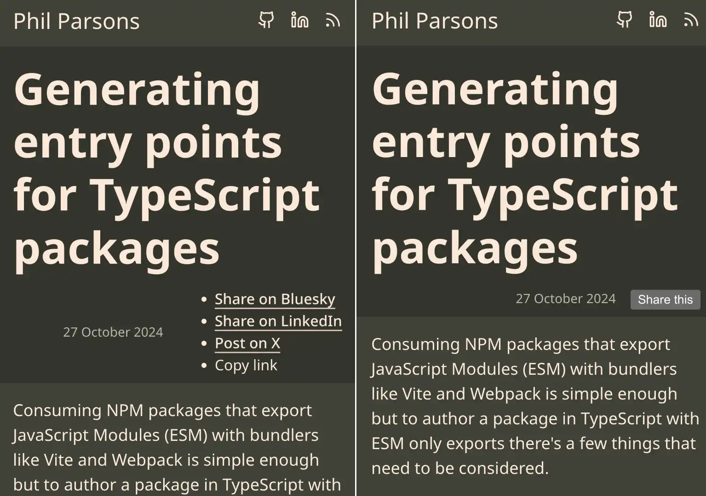

## What is FOUC and how does it apply to web components?

A [flash of unstyled content][fouc] (FOUC) occurs when content on a web page is visible
before it has had styling applied to it. This can happen for a few reasons, often while
loading images without dimensions, web fonts or JavaScript that applies styling to content
already visible in the page. Web components certainly suffer in the same way and introduce
other opportunities to FOUC things up, especially with the use of Shadow DOM and slots.

I'll disect the share button I recently bullt for my website to demonstrate some of the
issues web components face and look at how I prevented both a flash of unstyled content
and a [cumulative layout shift][cls].

## Building a share this button

The share button attempts to use the [native share functionality][navigator-share] in
the browser. At the time of writing this feature has good support across browsers but we
will provide a fallback list of links is as the initial content of the component.

```html
<share-button>
  <ul>
    <li>
      <a href="https://bsky.app/intent/compose?text={title}%20{url}">🦋 Share on Bluesky</a>
    </li>
    <li>
      <a href="https://www.linkedin.com/shareArticle?url={url}&title={title}">🏢 Share on LinkedIn</a>
    </li>
    <li>
      <a href="https://x.com/intent/post?url={url}&text={title}&via={author}">💩 Share on X</a>
    </li>
  </ul>
</share-button>
```

Once the component is defined and connected the list of links will be replaced but a single
share button.

Without applying any styles to the list we can easily see how a FOUC can also lead to an
unwanted cumulative layout shift. As the share button takes up less vertical space than the
list of links it causes the the page beneath the header to shift upwards once the share
button component is rendered.

<figure>
  
  <figcaption>
    Cumulative layout shift between the fallback links and share button
  </figcaption>
</figure>

### How to mitigate the cumulative layout shift

To avoid this layout shift the list of fallback links needs to occupy the same amount of
vertical space as the share button. This could be done by displaying the list items inline
but that wouldn't go any way to fixing the flash of unstyled content before the share button
is rendered. To solve both issues at once I made the fallback work in a similar way to the
the share button by using a popover for the fallback links with a button as the trigger.

```html
<share-button>
  <button popovertarget="share-fallback">Share</button>

  <div id="share-fallback" popover>
    <h2>Share this page</h2>

    <ul>
      <li>
        <a href="https://bsky.app/intent/compose?text={title}%20{url}">🦋 Share on Bluesky</a>
      </li>
      <li>
        <a href="https://www.linkedin.com/shareArticle?url={url}&title={title}">🏢 Share on LinkedIn</a>
      </li>
      <li>
        <a href="https://x.com/intent/post?url={url}&text={title}&via={author}">💩 Share on X</a>
      </li>
    </ul>
  </div>
</share-button>
```

Now if for some reason the native share functionality isn't supported or the web component isn't yet
connected the popover with the fallback list of links is displayed when the button is clicked.

### Using a named slot to share the button

With the share button in the Shadow DOM of the web component we'd have to share the CSS to style
both buttons the same way. This is of course possible but better yet the button in the fallback can
be used within the component through a named slot in a template.

```html
<share-button>
  <template shadowrootmode="open">
    <slot name="share-btn"></slot>
  </template>

  <button slot="share-btn" popovertarget="share-fallback">Share</button>

  <div id="share-fallback" popover>
    <h2>Share this page</h2>

    <ul>
      <li>
        <a href="https://bsky.app/intent/compose?text={title}%20{url}">🦋 Share on Bluesky</a>
      </li>
      <li>
        <a href="https://www.linkedin.com/shareArticle?url={url}&title={title}">🏢 Share on LinkedIn</a>
      </li>
      <li>
        <a href="https://x.com/intent/post?url={url}&text={title}&via={author}">💩 Share on X</a>
      </li>
    </ul>
  </div>
</share-button>
```
Because there is no default slot in the template to render the popover target it will no longer
be displayed when the button is clicked and only the native share functionality will be in effect.

You can view the full share button [code here][], feel free to use it on your own site.

## Handling FOUC without a fallback

As good developers we should be approaching our component development with a
[progressive enhancement][progressive-enhancement] mindset, as with the share button
example, but if your component does not have appropriate fallback or initial content
then a method of hiding it until it been defined can be used to prevent the flash of
unstyled content. A quick search, or prompt to your _trusted_ AI, on this subject will
likely lead you to the `:defined` CSS selector to hide the element until its defined.

```css
/* Hide the element until it's defined */
my-element:not(:defined) {
  display: none;
}

/* Show and style the element in it's defined state */
my-element:defined {
  display: block;
}
```

It's a valid approach but the potential for a cumulative layout shift is still present.
You could toggle the `visibility` or `opacity` of the component instead but if the
dimensions change when it becomes defined it will probably still cause a significant
layout shift. If we instead try to render the content, fallback or final, in the component
that is styled as close to the defined component as possible we can probably avoid these
issues and provide a better experience for our users.

[fouc]: https://en.wikipedia.org/wiki/Flash_of_unstyled_content
[navigator-share]: https://developer.mozilla.org/en-US/docs/Web/API/Navigator/share
[cls]: https://web.dev/articles/cls
[popover]: https://developer.mozilla.org/en-US/docs/Web/HTML/Global_attributes/popover
[progressive-enhancement]: https://www.gov.uk/service-manual/technology/using-progressive-enhancement
[defined]: https://developer.mozilla.org/en-US/docs/Web/CSS/:defined
